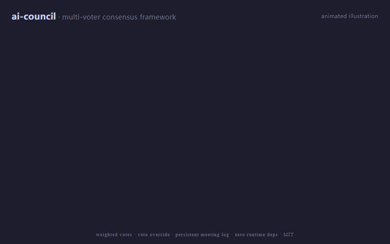

# ai-council

> Multi-voter consensus framework for LLM and heuristic decisions — composable Voters, weighted votes, optional veto, persistent meeting log.

**Stop rolling your own multi-LLM voting code.** If you have ever wired up "ask GPT-4 and Claude and a regex, then count the votes" inside a moderation pipeline, an agent router, or a code-review bot — this is the primitive you wanted. Zero runtime deps, ~200 LOC, MIT.

[](LICENSE)


> 🌏 [中文 README](README.zh-CN.md)



## 10-line taste

```python
from ai_council import Council, Vote, function_voter

def gpt4_voter(p, ctx, peers):    return Vote("gpt4",   approve=p["safe_gpt4"],   score=90)
def claude_voter(p, ctx, peers):  return Vote("claude", approve=p["safe_claude"], score=85)
def regex_voter(p, ctx, peers):
    bad = "kill" in p["text"].lower()
    return Vote("regex", approve=not bad, score=0 if bad else 100, veto=bad)  # hard red line

council = Council([function_voter("gpt4", gpt4_voter),
                   function_voter("claude", claude_voter),
                   function_voter("regex", regex_voter)], threshold=2)
decision = council.deliberate({"text": "...", "safe_gpt4": True, "safe_claude": True})
print(decision.approved, decision.final_score)  # True 91.67
```

That is the whole API surface. No subclassing, no config files, no orchestrator process.

## What this is

A tiny, dependency-free framework for **letting several "voters" decide together** — useful when one model or one rule is not trustworthy enough on its own. You assemble a `Council` from any number of voters, ask it to deliberate on a proposal, and get back a `Decision`.

Each `Voter` is just an object with a `name`, a `weight`, and a `vote(proposal, context, peers)` method. Inside, the voter can call an LLM, run a regex, hit a database, or ask a friend — the framework only cares about the `Vote` it returns.

## With ai-council vs. without

| Without ai-council | With ai-council |
|---|---|
| 80 lines of `if gpt_says and claude_says and not blocklist:` glue per project | 1 `Council(...)` line + N small voter functions |
| Threshold logic re-invented (and bugged) every time | `threshold=2` or `threshold=0.6` — int = absolute, float = ratio |
| Veto / hard-policy red lines bolted on with extra ifs | `Vote(..., veto=True)` from any voter blocks approval |
| Weighting senior voters means rewriting the aggregator | `function_voter("senior", fn, weight=2.0)` |
| Audit log is a `print()` you forgot to wire to a file | `JsonMeetingStore("meetings.jsonl")` — every decision persisted |
| One flaky LLM call crashes the whole pipeline | Exceptions are captured as `approve=False, score=0` (or `strict=True` to re-raise) |

## Why a separate framework

Multi-LLM ensembles and human-AI review boards keep getting re-implemented inside each project (trading bots, moderation pipelines, code review tools, agent routers). Each implementation tangles together:

- **What** is being decided (the proposal shape)
- **Who** votes (the voters)
- **How** the votes are combined (threshold, weights, veto)
- **Where** the audit log lives

`ai-council` separates the four. You bring the voters and the proposal; the framework owns the aggregation and the audit hand-off.

## Install

```bash
pip install ai-council              # once on PyPI
# or for now:
pip install git+https://github.com/lfzds4399-cpu/ai-council.git
```

Requires Python 3.11+. Zero runtime dependencies.

## 60-second example

```python
from ai_council import Council, Vote, function_voter

def cheap_voter(proposal, context, peers):
    cheap = proposal["price_usd"] < 100
    return Vote(voter="cheap", approve=cheap, score=80 if cheap else 20)

def reviewed_voter(proposal, context, peers):
    rated = proposal.get("rating", 0) >= 4.5
    return Vote(voter="reviewed", approve=rated, score=85 if rated else 30)

def stocked_voter(proposal, context, peers):
    in_stock = proposal.get("stock", 0) > 0
    return Vote(voter="stocked", approve=in_stock, score=90 if in_stock else 0,
                veto=not in_stock)  # out of stock → hard veto

council = Council(
    [
        function_voter("cheap", cheap_voter),
        function_voter("reviewed", reviewed_voter),
        function_voter("stocked", stocked_voter),
    ],
    threshold=2,                    # 2-of-3 must approve
)

decision = council.deliberate({"price_usd": 79, "rating": 4.7, "stock": 12})
print(decision.approved, decision.final_score)
# True 85.0
```

### LLM voter — same shape

Any object with `name`, `weight`, and a `vote(...)` method satisfies the `Voter` protocol — no inheritance needed. Drop your LLM client in directly:

```python
class ClaudeVoter:
    name = "claude"
    weight = 1.5

    def __init__(self, client): self.client = client

    def vote(self, proposal, context, peers):
        reply = self.client.messages.create(
            model="claude-sonnet-4-5",
            messages=[{"role": "user", "content": f"Approve this? {proposal}"}],
        )
        approve = "yes" in reply.content[0].text.lower()
        return Vote(voter="claude", approve=approve, score=90 if approve else 10)
```

The council does not care whether the voter is calling Anthropic, OpenAI, a SymPy verifier, or a sentiment classifier.

## Concepts

| Concept       | What it is                                                                 |
|---------------|----------------------------------------------------------------------------|
| `Voter`       | Anything with `name`, `weight`, and a `vote(proposal, context, peers)` method |
| `Vote`        | One voter's verdict: `approve` flag, `score` (0-100), reasons, optional `veto` |
| `Council`     | Holds a list of voters and the threshold; runs `deliberate(proposal)`      |
| `Decision`    | Aggregated outcome: `approved`, `final_score`, raw votes, timestamp        |
| `MeetingStore`| Optional persistence (`JsonMeetingStore` ships, write your own for DB)     |

### Threshold

- `threshold=2` — at least 2 voters must approve (absolute count)
- `threshold=0.6` — at least 60% (rounded up) must approve (ratio)

### Veto

Any voter can return `Vote(..., veto=True)`. A veto blocks approval **even if** the threshold is met. Use this for hard policy red lines (CSAM, unauthenticated payment, broken migration) where no consensus should override.

### Weighted score

`final_score` is the **weighted mean** of vote scores (the threshold check is unweighted — it's about how many voters approve). Boost a senior voter's influence with `weight=2.0` without giving them an outright veto.

### Defensive voter handling

If a voter raises an exception, by default it is logged and recorded as a `score=0, approve=False` vote — one flaky LLM call should not crash the council. Pass `strict=True` to re-raise instead.

```python
council = Council(voters, threshold=2, strict=True)  # fail loudly in dev
```

### Audit log

```python
from ai_council import JsonMeetingStore
council = Council(voters, threshold=2, store=JsonMeetingStore("meetings.jsonl"))
```

Every `deliberate()` call now persists the full `Decision` — proposal, votes, reasons, timestamp — so you can answer "why did we approve that PR / publish that post / buy that domain on 2025-04-12" months later.

## Examples

Three runnable examples in [`examples/`](examples) — each one wires up three voters for a different decision:

- [`domain_valuation.py`](examples/domain_valuation.py) — should we buy this domain? (SEO + brand + resale comp)
- [`code_review.py`](examples/code_review.py) — should we merge this PR? (correctness + style + readability)
- [`content_moderation.py`](examples/content_moderation.py) — should we publish this post? (policy + toxicity + reputation)

```bash
python examples/domain_valuation.py
```

## Where it fits

Good fits:

- **Multi-LLM ensembles** where you want each model's vote tracked + auditable (GPT + Claude + Gemini deciding together)
- **Agent routing / tool-call gating** — multiple critics vote before an agent takes an irreversible action
- **Moderation / approval flows** with a mix of model and rule-based gates
- **Code-review bots** where correctness, style, and security each get a voter
- **Decision logs** where you need to explain why a proposal passed or failed
- **Sensitive automation** where a single point of failure is unacceptable

Not a fit:

- One-call LLM judgements (just call the model)
- Reinforcement-learning style outcomes (no reward propagation here)
- Markets or auctions (use a price-clearing mechanism, not voting)

## Status

**Beta** — API surface is small and tested, but minor versions may still tweak names. Pin `ai-council==0.1.*` if you build on top.

## Contributing

Issues and PRs welcome. See pinned `help wanted` issues for low-effort first contributions: a vendored LLM-voter helper, additional `MeetingStore` backends (SQLite, Postgres), or a new domain example.

## Sibling projects

Other small, single-author harnesses I publish under [@lfzds4399-cpu](https://github.com/lfzds4399-cpu) — same MIT, same opinionated taste:

| Repo | One line |
|---|---|
| [**harness-engineering**](https://github.com/lfzds4399-cpu/harness-engineering) | The pattern (not a framework) that ai-council drops into as a validator stage — agents + validators + manifest, validated across 6+ projects |
| [**claude-screen-mcp**](https://github.com/lfzds4399-cpu/claude-screen-mcp) | MCP server letting Claude see your screen (Windows + macOS + Linux) — OCR + smart vision-diff |
| [**domain-harness**](https://github.com/lfzds4399-cpu/domain-harness) | Real-world consumer: every shortlisted domain is judged by a Claude + DeepSeek council before any registrar API is called |
| [**methods-harness**](https://github.com/lfzds4399-cpu/methods-harness) | SymPy-verified bilingual lesson pipeline for high-school calculus — same harness pattern |
| [**voice2ai**](https://github.com/lfzds4399-cpu/voice2ai) | Hands-free dictation for Windows — push-to-talk, 4 STT providers, 10+ chat apps |

If ai-council is useful, ⭐ the repo — it's the cheapest signal and it actually moves the needle.

## License

[MIT](LICENSE)
